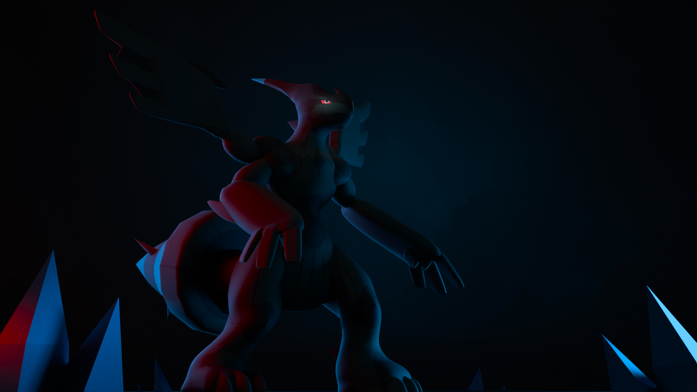

# Zekrom-BlenderPractice

This repository contains a small Blender project I made as practice.  
The subject is **Zekrom**, a Pokémon, modeled and rendered for learning purposes as part of a class project.

## Contents
- `zekrom.blend` → the Blender project file  
- `zekrom_render.png` → a rendered image preview  

## Preview

## Notes
- Created in **Blender 4.3.2**  
- This is a personal practice piece, not an official model  
- Feel free to open the `.blend` file and explore
- The preview has slightly altered lighting from the actual render output

## Copyright / Fan Art Notice

This project is a personal Blender practice piece and is **fan art**. The character depicted (Zekrom) and related intellectual property are owned by The Pokémon Company / Nintendo and their affiliates.

**This model and the files in this repository are provided for personal, educational, and non-commercial use only.**  
Do **not** sell, redistribute for profit, or claim this as an official work. If you require permission for commercial use, contact the rights-holders directly.

If you are a rights-holder and would like this content removed, please contact me and I will comply promptly.
